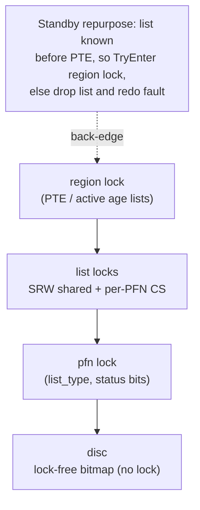

# Virtual Memory Manager

A user-mode Windows virtual memory manager written in C. It simulates the core of an operating system's memory manager (page faulting, trimming, eviction to a page file, aging, and reclaim) using a small pool of physical frames plus a simulated "disc" to back a much larger virtual address space. Frequently accessed data stays resident whereas cold data is paged out. Faults resolve as fast as possible.

## Goal

I reserve a large user-space virtual region and back it with a physical frame pool that is only a fraction of that space, so paging is always under pressure. By default:


| Quantity            | Value                                         | Define                     |
| ------------------- | --------------------------------------------- | -------------------------- |
| Physical frame pool | 1 GB → 262,144 frames                         | `NUMBER_OF_PHYSICAL_PAGES` |
| Page-file slots     | 1× the pool (262,144)                         | `NUM_DISC_PAGES`           |
| Virtual region      | `(physical + disc) × page size` ≈ 2× physical | `init.c`                   |


Thus, physical memory is about half the virtual footprint. Raising `NUM_DISC_PAGES` enlarges the backing store and deepens the pressure. The workload drives a randomized, locality-biased access pattern across the VA space from a pool of fault threads (`NUM_FAULT_THREADS`) alongside 5 background worker threads (`NUM_WORKER_THREADS`: trimmer, disc writer, ager, zero thread, periodic tuner). Cold data is aged out, written to the simulated page file, and its frame is recycled. Faults resolve as either soft faults (the frame is still resident on a transition list and just needs remapping) or hard faults (a frame is pulled from the standby / free / zero lists and read from disc if its contents were paged out).

## Roadmap

The manager was built in three stages, from a single-threaded state machine to a complex multi-threaded one.

### 1 · Single-threaded state machine

I learned important fundamentals through this iteration. I use Windows AWE (Address Windowing Extensions) primitives to control the virtual-address to physical-frame mapping directly. This is also where I learned about core data structures such as PTEs (Page Table Entries), PFNs (Page Frame Numbers), linked lists, and how to manage metadata.

**PTEs.** Each virtual address has a page table entry: a 64-bit code interpreted as one of three shapes through a union: a **valid** PTE (frame mapped), a **transition** PTE (frame still resident but unmapped), or a **disc** PTE (contents only on the page file, holding a disc index). The same 8 bytes encode every state with the low bits differentiating them. 40 bits hold the physical frame number. 40 bits is used since the address bus is 52 bits and a PTE maps a whole page, so the low 12 offset bits aren't needed (2⁵² / 2¹² = 2⁴⁰). A single PTE moves between those three shapes over its lifetime as its frame is mapped, trimmed, and paged out.

**PFNs.** Each physical frame has `pfn_metadata`, holding a `LIST_ENTRY`, a per-frame lock, its frame number, a back-pointer to the owning PTE, and other status bits. PFNs live in a large sparse array indexed by frame number, so accessing a frame's metadata is one index away. Because Windows hands out frames scattered across a wide range, the whole array is reserved with `MEM_RESERVE` and only the pages backing owned frames are committed with `MEM_COMMIT` (`ensure_metadata_slot_is_committed`).

**Lists.** I started with two lists: an **active** list of mapped frames and a free list of unused ones. The active list keeps pages sorted by age, so the oldest page can be found in constant time. 

**Disc.** To simulate a disc, a large region of memory is allocated with metadata tracking which slots are free. Writing a page out is a `memcpy` in, reading it back a `memcpy` out.

That was enough to handle a fault. I translated the VA to its PTE (valid bit clear), took a free frame (or evicted a victim off the active list, writing its contents to disc), read the faulting page's contents onto the frame, and set the valid bit.

### 2 · Basic multi-threaded state machine

Traces showed trimming and writing pages to the modified list were more costly work, so I moved these two tasks to dedicated worker threads, which caused other issues that I needed to deal with.

**Frames in transition between threads.** A modified list (frames are unmapped, dirty, not yet written) and a standby list (holds disc slot and clean frame) were added. Pages on both still hold the virtual page's contents, so they can be rescued. Being rescued means that if the old VA faults again, the frame is remapped with no disc read. A PTE bit marks the entry as in-transition, and then `pfn->list_type` records which list the frame is on. A standby frame can be repurposed for a new PTE as long as the PTE currently mapping it has its transition state clear. Frames now cycle through free → active → modified → standby (with the soft-fault shortcut back to active).

**Lock hierarchy.** With this version, I now had a region (PTE) lock, list locks, a per-page PFN lock, and a disc lock. These must be acquired and released in a certain order to prevent deadlock, a situation where one thread wants a lock held by another thread, but the other thread won't release that lock until the initial thread releases a different lock. The order is region first (it decides which list and thus which PFN to visit), then the list lock, then the PFN lock, and finally the self-contained disc lock. However, in one case, a standby page is repurposed, which requires reading the standby list to learn which PTE to target, but also needing that PTE's region lock. The fix is to hold the list first, then `TryEnterCriticalSection` the target region lock. Upon failure, the list lock is dropped and the fault is redone.

### 3 · Complex multi-threaded state machine

I implemented several optimizations across different areas to turn the slow state machine into a much more efficient one.

#### Batching

Every thread type batches to amortize syscall cost if possible. First, the trimmer removes up to `MAX_TRIM_PAGES` (512) frames from the active lists and unmaps them with one `MapUserPhysicalPagesScatter`. The disc writer pre-acquires up to `DISC_WRITE_BATCH` (64) pages and maps the whole batch into a contiguous scratch window with one `MapUserPhysicalPages`. The zero thread batch-maps 64 frames into a zeroing window, `memset`s, and batch-unmaps. Each fault thread owns a private ring of `STAGE_RING_PAGES` (512) staging VAs, so a disc read maps a frame into the next ring slot, copies, and defers the unmap. The ring is then torn down with a single scatter call when it wraps, turning two map calls per hard fault into one call most of the time.

#### PTE regions

PTEs are grouped into regions of `PTES_PER_LOCK` (512) entries. The page table is one flat array, so a region is just a slice of it. One region lock covers many PTEs, which amortizes aging overhead and lets the trimmer skip whole regions with no active entries.

#### Aging

Regions sit on one of `AGES` (8) age lists based on how recently their entries were accessed. The ager sweeps PTEs on a clock hand, checks the hardware-style accessed bit, and promotes or demotes regions between buckets. The trimmer then preferentially evicts the oldest regions. Recently touched pages are likely to be touched again, while untouched pages are good candidates for trimming.

#### Sharded free lists

To cut contention, the free list is split into shards (`NUM_FREE_SHARDS`) with a preferred shard per fault thread. Unlike standby, where ordering matters for aging, the free list can be split freely, so fault threads resolve faults with less contention.

#### Local caches

Each fault thread keeps a small thread-local cache of frames (`FREE_CACHE_MAX` = 64, `CACHE_REFILL_BATCH` = 32). With the local cache filled, a fault only needs the PTE region lock (unavoidable for correctness) and operates on cached frames with no extra synchronization between threads. The trimmer can reach into these caches (`free_caches[]`) under pressure and reclaim a not-yet-mapped page rather than evicting one from an active working set.

#### Zero thread

Windows never hands a process a page containing another process's data, so a demand-zero fault must produce a zeroed frame. Doing that inline costs a map, a `memset`, and an unmap. `zero_thread` / `zero_pfns` does it in the background, keeping `zeroList_head` topped up between `LOW_ZERO_PAGE_THRESHOLD` (pool/256) and `HIGH_ZERO_PAGE_THRESHOLD` (×4). Each pass claims up to `WRITE_BATCH` frames off the free shards and also claims frames off the standby list; it zeroes only the free-shard pages (map, `memset`, unmap) and publishes those to the zero list, while the standby-rescued frames are returned **un-zeroed** to the free shards (their contents are stale disc-backed data, not demand-zero pages). Draining standby this way keeps the shards from running dry under pressure.

#### Trimmer & periodic signaling

The trimmer signals the disc writer (`modifiedReady_event`) as it produces modified pages, so trimming and writing run concurrently. The trimmer runs slightly ahead because it never touches the disc. A `periodic_thread` wakes about once a second, estimates how long until dispatchable pages run out, and tunes trim aggressiveness and aging speed.

#### Fine-grained disc management

The single disc lock was replaced with per-slot atomics over a bitmap (`disc_bitmap`, 1 bit per slot). Frees are atomic bit-clears from any thread (`_interlockedbittestandset64` and friends), so many threads allocate disc slots at once and disc contention is no longer a bottleneck.

#### Concurrent standby and modified lists

These are the lists many threads want to access at once, and they can't be sharded because ordering matters. They use a `CONCURRENT_LIST_HEAD`, which has an `SRWLOCK` over the list, a `CRITICAL_SECTION` embedded in every PFN, and a `head_lock` for the sentinel (not a PFN and so has no lock of its own). Everyone enters the SRW lock as shared and locks individual nodes one at a time, so several threads can insert at the tail, remove from the middle, and scan simultaneously as long as they are not touching adjacent nodes.

- **"I want this exact node"** (`RWListInsertTail`, `RWListRemoveKnown`): used by a soft fault poaching one specific frame back. It cannot skip a contended neighbor, so it retries `LIST_COUPLE_MAX_FAILS` (4) times and then escalates to the exclusive writer, which guarantees the call eventually completes. Every critical section from the retry loop is released before escalating, so the escalation can never be the tail of a wait cycle.
- **"I want any eligible node"** (`RWListScanBegin` / `Next` / `RemoveCurrent` / `End`): used by the disc writer draining modified, the zero thread grabbing cold standby pages, and the fault path pulling a standby victim. This never escalates since a contended node is simply skipped and picked up on a later pass. The cursor always holds exactly two node locks, `pred` (the last node confirmed still linked) and `curr`. Advancing promotes `curr` into `pred`'s place rather than releasing it, because a subsequent removal needs `pred` to splice around whatever comes next. A successful `RWListScanRemoveCurrent` transfers ownership of the removed node's lock to the caller, mirroring `lock_pfn` / `unlock_pfn`.


## The complete state machine

Together, the fault decision, frame lists, worker threads, and optimizations form the current state of this complex multi-threaded state machine. Every fault is classified by its PTE state, resolved onto the active age lists, and every frame then cycles through the trimming, writing, zeroing, and reclaiming pipeline, with soft faults poaching frames before they're stolen.

## Scaling: runtime vs. thread count

**Setup.** 12 physical cores; 5 continuous worker threads plus the fault threads counted on the x-axis. Each fault thread does a **fixed** number of accesses (`MB_MUL=100`), so total work grows with thread count and the metric is wall-clock runtime — flat runtime therefore means throughput scales linearly (weak scaling). `NUM_FAULT_THREADS` was swept 1 → 12.


| Fault threads | Runtime (ms) |
| ------------- | ------------ |
| 1             | 9154         |
| 2             | 8741         |
| 4             | 8568         |
| 7             | 7997         |
| 8             | 8364         |
| 12            | 8379         |


Runtime holds flat (~7900–8700 ms), with the fastest runs near **7 fault threads** — the cores left after the 5 workers.

**Rationale.** The hot fault path is nearly contention-free: each thread pulls frames from its own thread-local cache and free shard and bumps its own stats slot, so fault threads rarely touch each other. The shared modified/standby lists are entered shared, with threads taking PFN locks with bounded retries before escalation to exclusive. `MapUserPhysicalPagesScatter`, which is the bulk of hard-fault time, runs outside any global lock. Region-lock contention on the active lists is negligible. Contention comes from disc-backed frames being supplied by a single-threaded trimmer. The per-fault access-violation sets the pace of the fault threads to that supply rate (at balance, fault-waits ≈ 0). Once enough fault threads saturate the producer and total threads approach the 12-core budget, extra fault threads have nothing more to consume, so runtime stays flat rather than dropping.

> **Note:** `NUM_FAULT_THREADS` ships at 7, the fastest configuration on a 12-core machine (12 cores − 5 workers). The table above is a sweep of that knob.


## Lock hierarchy

Acquire top → bottom and never the reverse.




## Windows APIs used

This program manages the VA↔frame mapping itself via AWE:

- `AllocateUserPhysicalPages` — grabs the physical frame pool.
- `VirtualAlloc2` with `MemExtendedParameterUserPhysicalHandle` — reserves VA regions bound to the AWE handle (plain `VirtualAlloc(MEM_PHYSICAL)` is not bound to the handle and won't work).
- `MapUserPhysicalPages` **/** `MapUserPhysicalPagesScatter` — map and unmap frames under virtual addresses.
- `CreateFileMapping2` — backs the simulated disc.
- **Interlocked operations** (`InterlockedCompareExchange64`, `InterlockedAdd64`, `_interlockedbittestandset64`, …) — lock-free counters and the disc bitmap allocator.

Running requires the `SeLockMemoryPrivilege` (acquired at startup via `GetPrivilege` in `init.c`), so the process must run elevated / with that privilege granted.

## Building

Requires MSVC and CMake on Windows.

```bash
cmake -B build
cmake --build build
```

> **Note:** After any change to a struct layout, delete the CMake output directory and rebuild fully. Stale object files cause offset mismatches that surface as bizarre runtime corruption.


## Running

Run the resulting `ZoeVM.exe` (elevated, for the lock-memory privilege). It executes `full_virtual_memory_test`, which spins up the fault and worker threads, drives the access pattern, and prints fault counts and statistics.

Key tunables live in `vm.h`:

- `NUMBER_OF_PHYSICAL_PAGES` — size of the physical frame pool.
- `NUM_DISC_PAGES` — page-file slots (raise for more paging pressure).
- `NUM_FAULT_THREADS` / `NUM_WORKER_THREADS` — thread counts.
- `MB_MUL` — workload size (accesses per fault thread).
- `MAX_TRIM_PAGES`, `POOL_HIGH_WATER`, and the zero/free watermarks — reclaim thresholds.
- `AGES`, `AGE_TICK_MS` — aging granularity and cadence.
- `DEBUG`, `STATISTICS` — enable `ASSERT`/`DebugBreak` and per-phase profiling.


## Source layout


| File                  | Contents                                                                                                                            |
| --------------------- | ----------------------------------------------------------------------------------------------------------------------------------- |
| `vm.h`                | Shared declarations: tunables, PTE/PFN/region/list structs. **Start here.**                                                         |
| `vm.c`                | Main driver, thread routines (trim/disc/age/periodic/zero), staging, disc-slot allocator, aging, statistics. Most logic lives here. |
| `globals.c`           | Definitions of the shared global state (`globals.h` is currently empty).                                                            |
| `init.c` / `init.h`   | Privilege acquisition, AWE setup, VA reservation, page-file mapping, disc bitmap init.                                              |
| `pte.c` / `pte.h`     | PTE and PTE-region manipulation.                                                                                                    |
| `pfn.c` / `pfn.h`     | PFN metadata, frame acquisition, standby rescue, free-page caches.                                                                  |
| `list.c` / `list.h`   | Concurrent list infrastructure (the RW-list API).                                                                                   |
| `fault.c` / `fault.h` | Soft / hard / prefetch fault handlers.                                                                                              |
| `disc.c` / `disc.h`   | Disc declarations (`disc.c` is an empty stub; the allocator lives in `init.c` + `vm.c`).                                            |
| `stats.c` / `stats.h` | Statistics declarations (`stats.c` is an empty stub; the stat routines live in `vm.c`).                                             |
